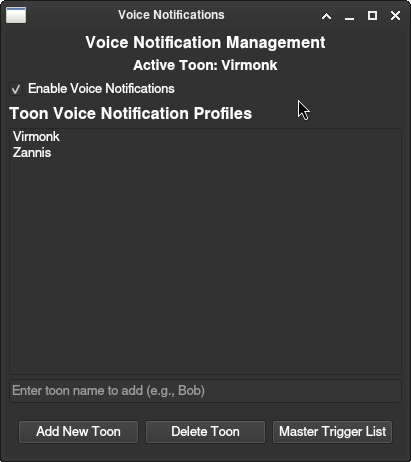
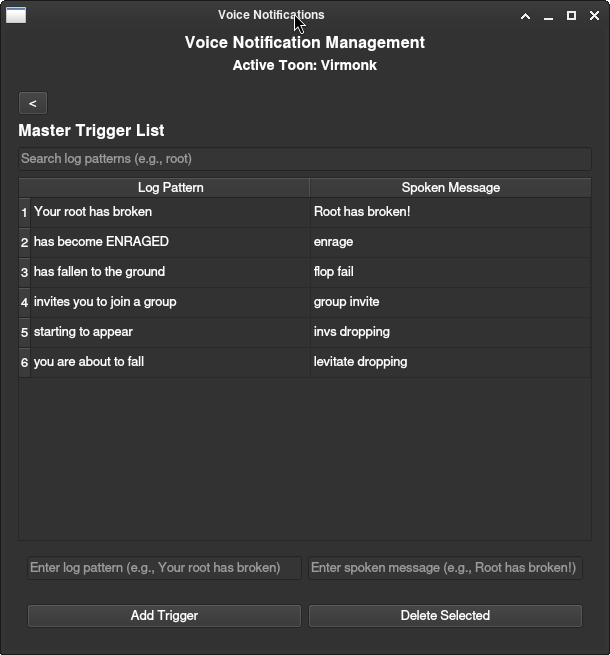
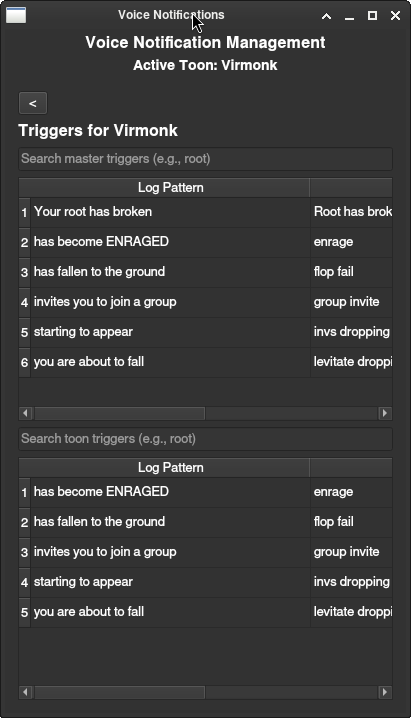
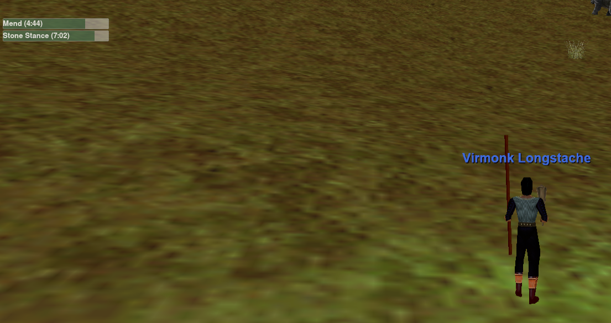
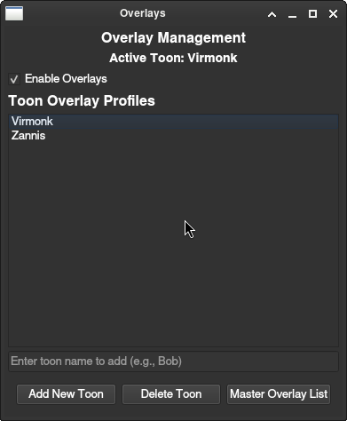
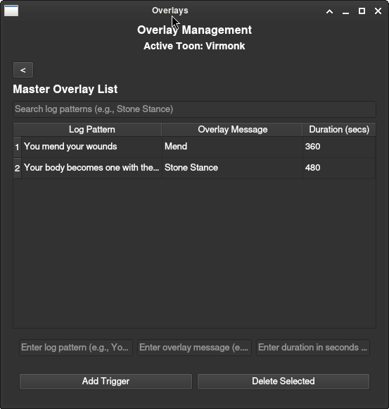
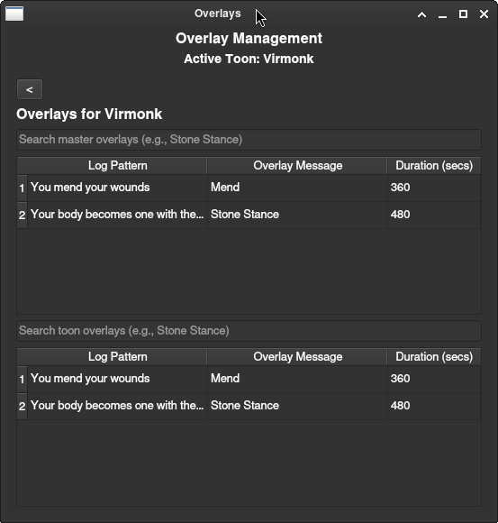

# EQ-Virtools

EQ-Virtools is a Linux utility for EverQuest that provides:
- Mob respawn timers
- Voice notifications
- Overlays
- Auto toon detection
- Auto zone detection
- Auto zone spawn timer detection

## Prerequisites


- **Operating System**: Linux.
- **Python**: 3.10 or higher.
- **Docker(optional)**: Required for containerized setup.
- **Dependencies**:
  - System: `python3`, `python3-pip`, `libasound2`, `libx11-6`, `libxcb1`.
  - Python: `gTTS==2.5.1`, `PyQt6==6.7.0`, `pygame==2.5.2`.
  - Docker: Includes all dependencies (`libqt6core6`, `libqt6gui6`, `libqt6widgets6`, `libsdl2-2.0-0`, etc.).


## Installation

### Option 1: Manual Installation

1. Clone the repository:
   ```bash
   git clone https://github.com/your-username/eq-virtools.git
   ```
2. Install dependencies:

   **Arch Linux**:
   ```bash
   sudo pacman -Sy python python-pip alsa-lib libx11 libxcb
   pip3 install gTTS==2.5.1 PyQt6==6.7.0 pygame==2.5.2
   ```

   **Ubuntu (24.04 or later)**:
   ```bash
   sudo apt update
   sudo apt install python3 python3-pip libasound2 libx11-6 libxcb1
   pip3 install gTTS==2.5.1 PyQt6==6.7.0 pygame==2.5.2

   ```

### Option 2: Docker Installation

1. Install Docker
2. Clone the repository:
   ```bash
   git clone https://github.com/your-username/eq-virtools.git
   ```
3. Build the Docker image:
   ```bash
   docker build -t eq-virtools .
   ```
4. Run the container, mounting your log directory:
   ```bash
   xhost +local:docker
   docker run --rm -it -v /home/$USER/Games/everquest/Logs:/app/logs --env DISPLAY=$DISPLAY --net=host eq-virtools
   ```


## Usage

1. Run the app:
   - Manual: `python3 eq_virtools.py`
   - Docker: See Docker installation step 4.
2. From the system tray icon:
   - **Set log directory** to your EverQuest `Logs` directory.


## Features
### Timer Tool
Timer Tool opens the `Mob Respawn Timer` UI where mob deaths are tracked. It auto detects what zone you are in and loads the zone spawn timer
for that zone. A custom spawn timer can be defined as well in the `Custom Time` box. Mobs can be deleted from the list by double  clicking the mob name.
By right clicking a mob you can change the color of the mob name that can be useful for marking place holders or marking important mobs.


### Voice Notifications
Voice Notifications provides audible voice notifications via TTS when triggers you define are found in the log file.

**First add your toon to the profiles list.**



**Then add some Master Triggers**

`Master Triggers List`  is a master list of all of your triggers. This is where you can add or delete triggers that will be available to all of your
toons. You can modify an existing trigger by double clicking in the chosen field. As the list grows use the `search log patterns` to quickly search for existing
triggers. To go back to the main profile page by clicking the `<` button.



**Last add triggers to toon profiles**

On the main profile page double click on the toon you want to add triggers to. This will open the `Trigges` list for that toon. The top list is your master trigger list
and the bottom list are the active toon triggers. To add a trigger from you master trigger list simply double click the trigger. To remove a active trigger from your
toon triggers double click the trigger. 



### Overlays
Overlays adds an overlay to the screen that can be used to track skill cool downs or what ever you like. The overlay can be positoned anywhere you like on the screen.
Overlays management works the same as the `Voice Notifications` as seen above.

**Important!!!**
**Some window managers will have an option to give newely created windows focus. This will cause the overlay to take focus away from EverQuest.**
**If you are experiencing this issue you will need to disable that option in your window manager.**




**Add Your Toon**



**Add Overlay Triggers**



**Add Overlay To Toon**



## Contributing

Submit issues or PRs on GitHub. Use feature branches.

## License

[MIT License](LICENSE)
